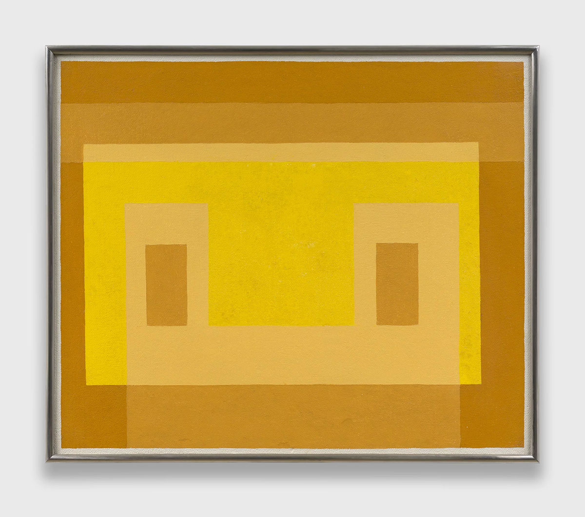
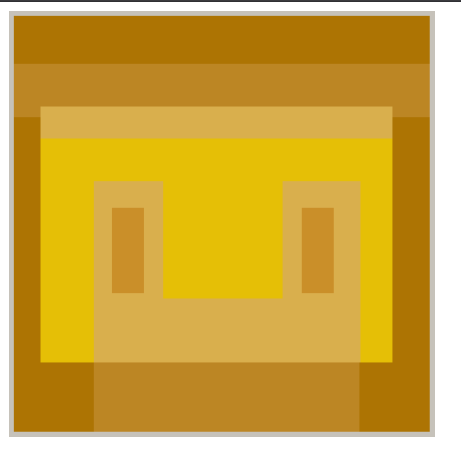

# Ponderada UX — P5.js

## Pintura de referência vs. Réplica

<table>
  <tr>
    <th>Original</th>
    <th>Réplica (p5.js)</th>
  </tr>
  <tr>
    <td></td>
    <td></td>
  </tr>
</table>

**Adobe: Yellow Front. Josef Albers, 1959.**
Oil on Masonite, 22 x 26 1/8 inches (55.9 x 66.4 cm)
Framed: 22 1/2 x 26 3/4 inches (57.2 x 67.9 cm)
© The Josef and Anni Albers Foundation, Courtesy The Josef and Anni Albers Foundation and David Zwirner Gallery

## Arquivos

- `index.html` — página principal que carrega o sketch
- `LeunamSousa.js` — sketch p5.js com a recriação da pintura

## Descrição

Recriação da obra _Adobe: Yellow Front_ de Josef Albers em p5.js.
